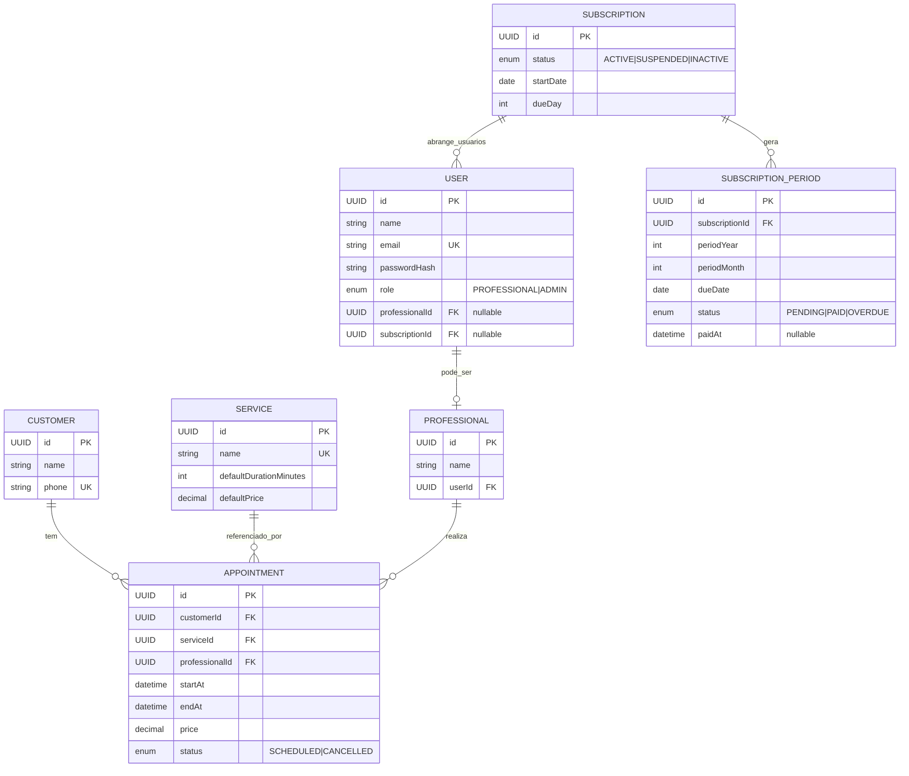

# 🛠️ Architecture / Software Design Document

**Projeto:** SalonBooking
**Versão:** 1.0.0 · revisão para Entrega 1
**Última atualização:** 2026-10-06

> 🤖 **O `prd.md` responde _o quê_ o produto faz. Este responde _onde as coisas
> moram e como se chamam_.** Detalhe de tela — rota, componente, contrato —
> **não** se decide aqui: isso é trabalho da spec de cada história.
>
> ✍️ **Não preencha na mão:** rode `/utf-architecture` (depois do `/utf-prd` e do `/utf-flows`).
> A entrevista decide com você cada seção e garante as quatro declarações que o
> `/utf-setup` exige: **framework do backend, framework do frontend, estrutura
> do monorepo e como rodar os testes.**

---

## 🤖 1. Fontes de Contexto para a IA

> Onde a IDE agêntica busca a verdade. **Isto é o índice; a configuração mora
> nos arquivos** — documento não configura ferramenta.

| Fonte | Onde configurar | Serve para |
| :---- | :-------------- | :--------- |
| Constituição da IA | `.agents/rules/utf-rules.md` (via `CLAUDE.md`) | Regras inegociáveis: fases do SDD, 2 rodadas, revisores distintos, Git |
| Fluxos da IA | `.agents/workflows/` | PRD, backlog, jornadas e tokens, architecture, setup, ciclo por Issue, ciclo por tarefa, tutor |
| Agentes (subagentes) | `.agents/agents/` (cascas em `.claude/`, `.cursor/` e `.opencode/`) | Implementador, revisores, auditor final e tutor |
| Ficha da disciplina | `docs/checklist.md` | Regras do projeto, IDs e entregas |
| Design (Figma/Stitch) | https://www.figma.com/design/u5OT3oRC8pWXQsqK3N2eYL/SalonBookin | Cores, tipografia, hierarquia visual |

---

## 📦 2. Stack Tecnológica

> Definição **estrita**: nenhuma dependência entra sem aparecer aqui. Esta
> seção e o `package.json` contam a mesma história, ou o projeto já se perdeu.
> O que a ficha da disciplina fixa entra como está; o que ela deixa livre é
> decidido na entrevista.

- **Backend:** NestJS (Node.js + TypeScript)
- **Frontend:** React (TypeScript)
- **Padrões de código do frontend:** Componentes funcionais com hooks, organização por feature/domínio, camada de repositório/serviço para acesso à API
- **Estilo:** CSS convencional (conforme tokens definidos em `docs/design-tokens.md`)
- **Testes:** Ferramentas definidas no `package.json` de cada app (backend e frontend), com comandos de suíte e lint a configurar no setup

### 🧱 2.1. Backend — regras estruturais

> Conforme RA2 do checklist (IDs 6–10): separação estrita de camadas, DTOs + ValidationPipes com whitelist, Prisma para persistência/CRUD relacional, JWT + Roles/Guards, Interceptors e Exception Filters globais.

- **Camadas (ID6):** Separação estrita entre **Controllers**, **Services** e **Modules**. Componentes de infraestrutura permanecem em módulos dedicados. Repositórios acessam o banco exclusivamente via **Prisma**.
- **Validação de entrada (ID7):** Uso de **DTOs** com `class-validator` e **ValidationPipe** configurado com `whitelist: true` (descarta campos não mapeados), `transform: true` e tratamento padronizado de erros.
- **Persistência (ID8):** **Prisma ORM** para acesso relacional ao PostgreSQL. Operações CRUD planejadas de forma relacional, com mapeamento 1:N coerente com o modelo.
- **Autenticação e autorização (ID9):** **Autenticação JWT** (Bearer). Controle de acesso via **Guards** e **Roles** (mapeando os papéis: **administradora** e **profissional**), conforme RN15–RN16.
- **Tráfego e erros (ID10):** **Interceptors** para padronizar respostas da API. **Exception Filters globais** para tratamento unificado de exceções.

### 🌐 2.2. O contrato da API

> Conforme **ID14** do checklist, a API **NestJS** deverá expor **documentação Swagger atualizada e interativa**. A documentação viva é gerada a partir do código (anotações/Decorators) e servida pela própria API (ex.: `/api/docs`). O arquivo gerado não será commitado. Nenhum endpoint específico é listado neste documento — contratos nascem nas specs de cada história.

---

## 🗂️ 3. Estrutura do Repositório (Monorepo)

> Uma pasta por aplicação, cada uma com o seu `package.json`. Sem npm
> workspaces, Nx ou Turborepo enquanto não houver código compartilhado de
> verdade — ferramenta sem problema para resolver é só custo.

```text
.
├── .agents/               # constituição, workflows e prompts dos agentes (§1)
├── .claude/ .cursor/ .opencode/   # cascas de cada ferramenta — só apontam para .agents/
├── .github/               # template de PR e o Portão de Entendimento
├── CLAUDE.md  AGENTS.md   # carregam a constituição em toda sessão
├── README.md              # a vitrine: o que é e como rodar
├── docs/                  # prd.md, user-flows.md, design-tokens.md, este arquivo, checklist.md e guias
├── specs/                 # uma pasta por história
└── apps/
    ├── api/       # NestJS
    └── web/       # React
```

---

## 🏗️ 4. Arquitetura Frontend

> 📏 **Regra geral:** componentes não falam diretamente com o servidor. Todo acesso à API passa por uma camada de repositório/serviço — mudanças de contrato afetam apenas essa camada, nunca as telas.

O frontend será **React com TypeScript** e seguirá esta organização arquitetural geral:

- **Componentes funcionais com hooks:** UI construída com componentes funcionais, utilizando hooks nativos do React para estado e efeitos colaterais.
- **Organização por feature/domínio:** estrutura organizada por domínio/feature (coerente com o Mapa de Domínios §6), visando coesão e baixo acoplamento.
- **Camada de repositório/serviço:** toda comunicação com a API ocorre por meio de serviços/repositórios (separação entre UI e acesso a dados), sem acoplamento direto de componentes a chamadas HTTP.
- **Separação de responsabilidades:** lógica de apresentação, estado e acesso a dados mantidos em camadas distintas, conforme o princípio de responsabilidade única.

---

## 🗄️ 5. Arquitetura de Dados

### 📖 5.1. Glossário Técnico (Mapeamento)

> Ponte entre português (PRD §2) e inglês (código). **Interface em português; código e dados em inglês.** Mapeamento derivado exclusivamente do PRD.

| Termo PRD (PT-BR) | Entidade técnica (EN) | Atributos principais (derivados do PRD) |
| :---------------- | :-------------------- | :-------------------------------------- |
| **Cliente** | `customer` | `id`, `name`, `phone` (único) — RN03; US01 |
| **Procedimento** | `service` | `id`, `name` (único), `defaultDurationMinutes`, `defaultPrice` (>= 0/validação) — RN04, RN05; US02 |
| **Agendamento** | `appointment` | `id`, `customerId` (FK), `serviceId` (FK), `professionalId` (FK), `startAt`, `endAt`, `price` (>= 0), `status` (`SCHEDULED`/`CANCELLED`) — RN01–RN02, RN06–RN11; US03–US06 |
| **Profissional** | `professional` | `id`, `name`, `userId` (FK para `user`) — RN15 (gerencia próprios agendamentos) |
| **Administradora** | `user` (com `role = ADMIN`) | `id`, `name`, `email`, `role = ADMIN`, `subscriptionId` (FK) — responsável por gerenciar o salão e a assinatura (RN15–RN16) |
| **Assinante** | (papel/atributo da Administradora) | A **administradora** é a assinante (quem contrata e paga a mensalidade). Não é uma entidade separada (RN15–RN16) |
| **Usuário (Conta de acesso)** | `user` | `id`, `name`, `email` (único), `passwordHash`, `role` (`PROFESSIONAL` \| `ADMIN`), `professionalId` (opcional), `subscriptionId` (FK) — US08–US09, RN13–RN16 |
| **Assinatura** | `subscription` | `id`, `status` (`ACTIVE` \| `SUSPENDED` \| `INACTIVE`), `startDate`, `dueDay` — controla acesso (RN12); US07 |
| **Mensalidade** | `subscriptionPeriod` | `id`, `subscriptionId` (FK), `periodYear`, `periodMonth`, `dueDate`, `status` (`PENDING` \| `PAID` \| `OVERDUE`), `paidAt` — RN12; US07 |

### 📊 5.2. Diagrama ER (Mermaid)

> Entidades e relacionamentos derivados do PRD. Representa o necessário para US01–US07 (cadastros, agenda com conflito por profissional, assinatura/mensalidade e acesso por usuário/papel). Regras como "não editar cancelado" ou "conflito apenas por sobreposição" são de negócio (validadas em camada de serviço); não forçam complexidade no Mermaid.



### 🌍 5.3. O banco por ambiente

| Ambiente | Onde roda | Como conecta |
| :--- | :--- | :--- |
| **Local** | PostgreSQL local (container/instalação) | Via `DATABASE_URL` (não commitado). |
| **CI** | Banco relacional isolado no pipeline (GitHub Actions) | Injetado via secrets/variáveis do ambiente. |
| **Produção** | PostgreSQL em nuvem (**Neon.tech** ou **Vercel Postgres**) com **Connection Pooling** do Prisma | Injetado via variáveis de ambiente/Secrets da plataforma. |

> 🔒 Credenciais **nunca** aparecem no repositório — nem em código, nem em YAML, nem em doc. Só nos *secrets* da plataforma.

---

## 🗺️ 6. Mapa de Domínios

> Derivado das histórias do PRD (US01–US07). Rotas/contratos vivem na API viva (§2.2) e nas specs; não são copiados aqui.

| Domínio | Módulo (pasta) | Guard | Dados (repository) | US |
| :------ | :------------- | :---- | :----------------- | :-- |
| **Autenticação e Acesso** | `apps/api/src/auth` / `apps/web/src/features/auth` | JWT + RolesGuard (ADMIN/PROFESSIONAL) | User/Professional | US08, US09, RN13–RN16 |
| **Cadastros (Clientes)** | `apps/api/src/customers` / `apps/web/src/features/customers` | RolesGuard (ADMIN/PROFESSIONAL) | Customer | US01, RN03, RN15 |
| **Cadastros (Procedimentos)** | `apps/api/src/services` / `apps/web/src/features/services` | RolesGuard (ADMIN/PROFESSIONAL) | Service | US02, RN04–RN05, RN15 |
| **Agenda / Agendamentos** | `apps/api/src/appointments` / `apps/web/src/features/appointments` | RolesGuard + propriedade (PROFESSIONAL só próprios; ADMIN todos) | Appointment (com FKs Customer/Service/Professional) | US03–US06, RN01–RN02, RN06–RN11, RN15 |
| **Assinatura e Mensalidade** | `apps/api/src/subscriptions` / `apps/web/src/features/subscriptions` | RolesGuard (restrito a ADMIN/assinante) | Subscription, SubscriptionPeriod | US07, RN12, RN15 |

---

## 📅 7. Histórico

| Data | Versão | O que mudou |
| :--- | :----- | :---------- |
| 2026-09-13 | 1.0.0 | Versão inicial via `/utf-architecture` (esqueleto) |
| 2026-10-06 | 1.0.0 | Revisão para Entrega 1: preenchimento com base em PRD, user-flows, design-tokens e checklist (NestJS + Prisma + PostgreSQL; React; regras estruturais IDs 6–10; Swagger ID14; ER derivado do PRD; glossário técnico; domínios; ambientes) |

---

## 🛑 O que ainda **não** está neste documento

Detalhes de funcionalidade — DTOs de endpoints específicos, máquinas de estado
de uma história — **não entram aqui**: nascem sob demanda no `spec.md` de cada
história. Este documento guarda só o que vale para o sistema inteiro.
