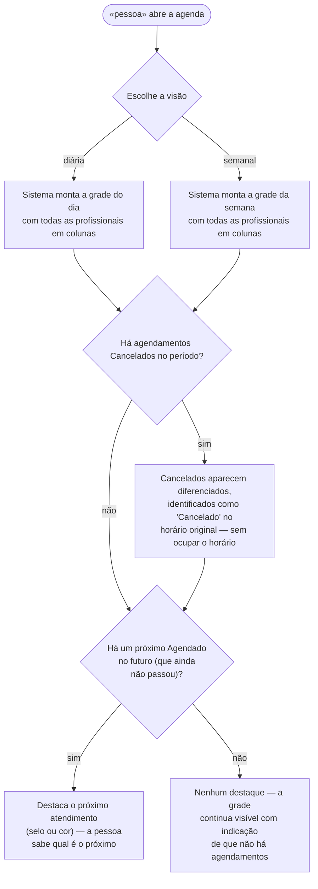
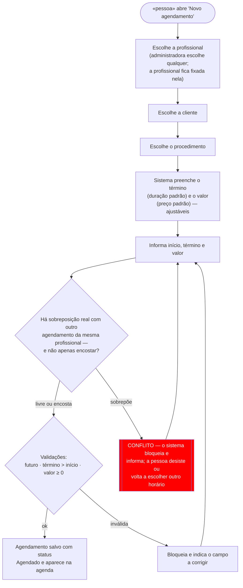
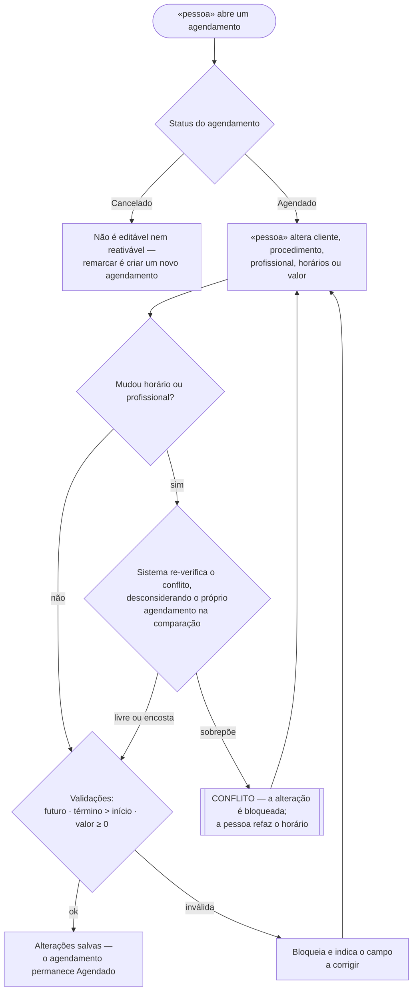
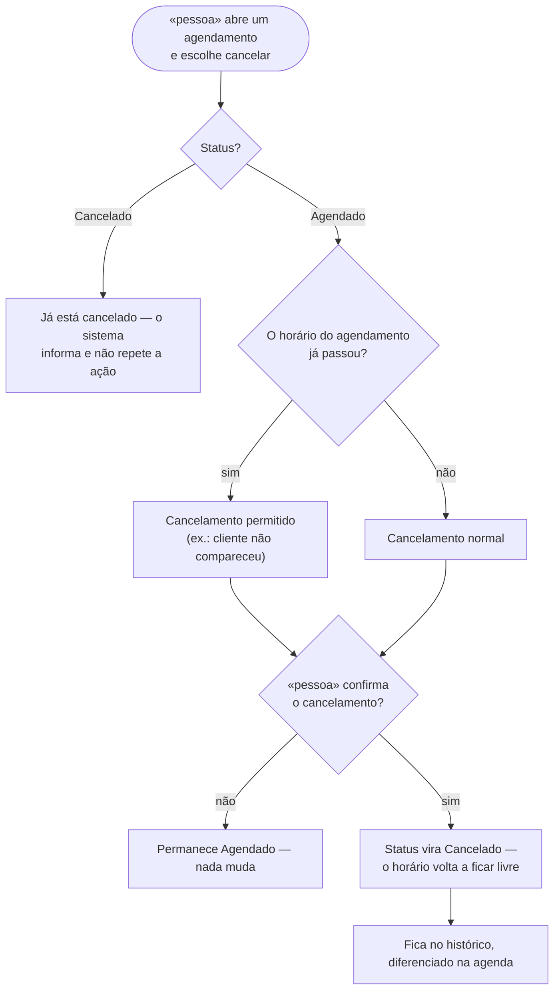

# 🗺️ Jornadas de Usuário

**Projeto:** SalonHub
**Versão:** 1.0.0 · elaborado a partir do `docs/prd.md`
**Última atualização:** 2026-09-13

> 🤖 **Este documento é a fonte da verdade sobre O QUE A PESSOA VIVE na tela** —
> o caminho do primeiro clique até o objetivo, e principalmente os pontos onde ela
> trava, espera ou desiste.
>
> 🚫 **Não duplico:** regra de negócio mora no `prd.md`; estado, entidade e contrato
> moram no `architecture.md`. Aqui mora o caminho. As regras aqui respeitadas são as
> do PRD (RN01–RN16): horários **sobrepostos** são bloqueados, horários **encostados**
> são permitidos e um agendamento **cancelado libera o horário**.

---

## Fluxo 1 — Visualizar a agenda semanal

**Story:** US06
**Critérios que marca:** depende do tempo · pode ser abandonada na leitura (perder o próximo atendimento)

**O que decidimos:** a visualização é somente leitura e vale para todos os usuários. Um agendamento cancelado continua aparecendo no horário original — diferenciado — para preservar o histórico, mas não ocupa o horário: outro agendamento pode ser criado naquele período. O destaque do próximo atendimento é o recurso que combate o esquecimento no MVP.

---

## Fluxo 2 — Criar um novo agendamento

**Story:** US03
**Critérios que marca:** depende do tempo · conflito de horário (RN01) · pode ser abandonada na escolha do horário

**O que decidimos sobre o nó vermelho:** o conflito de horário é o ponto em que a pessoa pode **desistir** de agendar — ou **voltar para escolher outro horário**. O sistema trata os dois casos da mesma forma: a tentativa é **bloqueada** e o sistema informa a sobreposição, sem criar o agendamento. O agendamento já existente continua ocupando o período, e a pessoa refaz a escolha. Só a **sobreposição real** vira conflito: um horário que **encosta** de ponta a ponta com outro é permitido, porque não há dois atendimentos da mesma profissional ao mesmo tempo.

---

## Fluxo 3 — Editar um agendamento

**Story:** US04
**Critérios que marca:** depende do tempo · conflito de horário ao mudar data/profissional (RN01) · pode ser abandonada

**O que decidimos sobre o nó vermelho:** quando a edição muda o **horário ou a profissional**, o sistema re-verifica o conflito do zero — ignorando o próprio agendamento, para ele não "conflitar consigo mesmo". Se houver sobreposição real com outro agendamento da mesma profissional, a alteração é **bloqueada** e a pessoa refaz o horário (Encontros de ponta a ponta seguem permitidos). Agendamentos com status **Cancelado** não podem ser editados nem reativados: para remarcar, cria-se um novo agendamento.

---

## Fluxo 4 — Cancelar um agendamento

**Story:** US05
**Critérios que marca:** depende do tempo · pode ser abandonada no meio · registro de não comparecimento

**O que decidimos:** o cancelamento precisa de **confirmação**; sem ela, nada muda. Ao confirmar, o status passa a **Cancelado** e o horário **deixa de ocupar a agenda** — volta a aceitar um novo agendamento naquele período. Não há motivo obrigatório. O cancelamento também vale para horários **já passados** (ex.: não comparecimento), já que o MVP não tem o status "Concluído" — a restrição de "não mexer no passado" vale apenas para criar/editar.

---

## Dúvidas em aberto

| # | Dúvida | Onde ela precisa ser resolvida |
| --- | --- | --- |
| 1 | Forma de pagamento da mensalidade (Pix, boleto, cartão) e gateway — a jornada de pagamento da US07 será desenhada quando essa decisão existir | `docs/architecture.md` / planejamento da US07 |